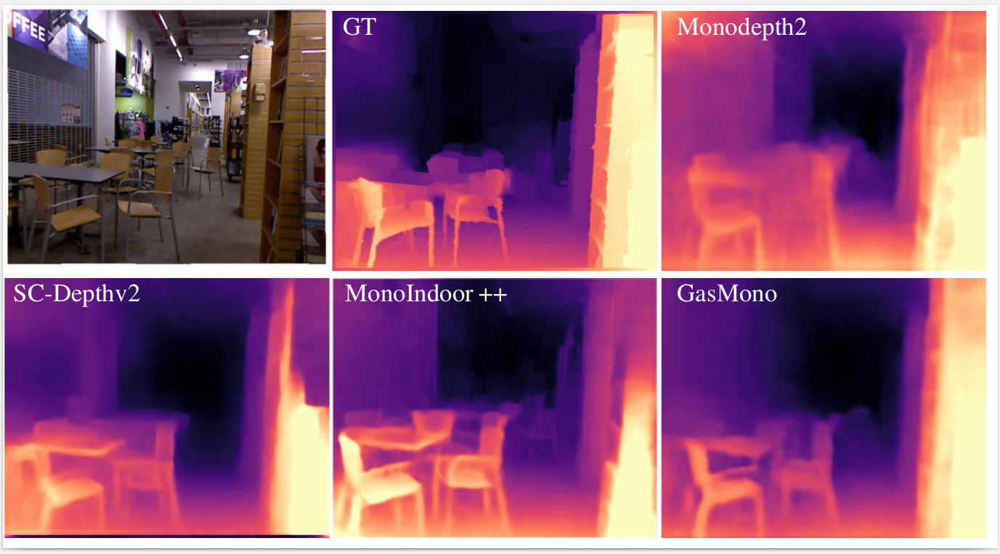
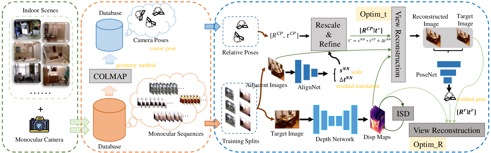
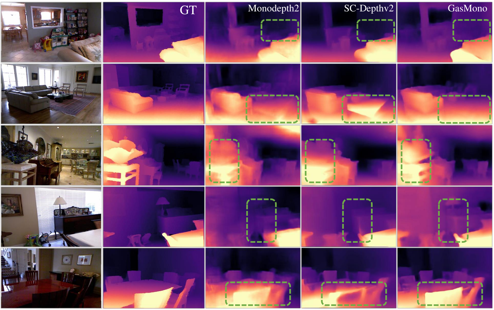
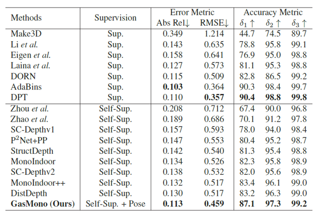

<h1 align="center"> GasMono: Geometry-Aided Self-Supervised Monocular Depth 
Estimation for Indoor Scenes <br> (ICCV 2023) </h1> 

This is the reference PyTorch implementation for training and testing depth estimation models using the method described in

> GasMono: Geometry-Aided Self-Supervised Monocular Depth 
Estimation for Indoor Scenes

> [ICCV 2023](https://iccv2023.thecvf.com/)

>by
[Chaoqiang Zhao](https://zxcqlf.github.io/), [Matteo Poggi](https://mattpoggi.github.io/), [Fabio Tosi](https://fabiotosi92.github.io/), [Lei Zhou](), [Qiyu Sun](), [Yang Tang ](http://www.ytangecust.com/), and [Stefano Mattoccia](http://www.vision.disi.unibo.it/smatt/)

[Paper](https://openaccess.thecvf.com/content/ICCV2023/papers/Zhao_GasMono_Geometry-Aided_Self-Supervised_Monocular_Depth_Estimation_for_Indoor_Scenes_ICCV_2023_paper.pdf)

<p align="center">
  
</p>


## ⚙️ Introduction

We propose **GasMono**, which tackles the challenges of self-supervised monocular depth estimation in indoor scenes caused by large rotation between frames and low texture. We ease the learning process by obtaining coarse camera poses from monocular sequences through multi-view geometry to deal with the former. However, we found that limited by the scale ambiguity across different scenes in the training dataset, a na\"ive introduction of geometric coarse poses cannot play a positive role in performance improvement, which is counter-intuitive.
To address this problem, we propose to refine those poses during training through rotation and translation/scale optimization.
To soften the effect of the low texture, we combine the global reasoning of vision transformers with an overfitting-aware, iterative self-distillation mechanism, providing more accurate depth guidance coming from the network itself.
Experiments on NYUv2, ScanNet, 7scenes, and KITTI datasets support the effectiveness of each component in our framework, which sets a new state-of-the-art for indoor self-supervised monocular depth estimation, as well as outstanding generalization ability.


**Contributions:** 

* We tackle **the challenges of learning camera poses** in indoor scenes by exploiting strong priors coming from classic structure-from-motion algorithms.

* This, however, is not sufficient: we explore the factors in such an approach making the training process unstable and a further, 
**learning-based refinement strategy** is proposed to optimize both rotation and translation/scale of the initial poses.

* We explore the effectiveness of transformer architecture in improving the depth estimation of low-texture regions for indoor scenes, 
coupled with an **overfitting-aware iterative self-distillation method**, iteratively distilling pseudo labels from the depth network itself.

* Our GasMono framework is evaluated on a variety of indoor datasets, establishing  **a new state-of-the-art for indoor, self-supervised monocular depth estimation**.

**💾 Architecture Overview** 

For indoor self-supervised monocular depth estimation task, there are two big challenges, the one is "**inter-frame pose estimation**" and another is "**low texture regions**"


<p align="center">
  
</p>


**💾 Pose estimation:**

Given the challenges of **learning an accurate relative pose between images** in presence of large rotations, we propose to get rid of the commonly used PoseNet and replace it with a traditional pose estimation algorithm. For this purpose, we leverage COLMAP to obtain coarse camera poses, this method is widely used in Nerf.

Nonetheless, poses estimated by COLMAP, which we will refer to as **coarse** from now on, suffers from some problems, specifically 
* scale inconsistency across different sequences and scale drift within the very same scene because of monocular ambiguity.
* noise in estimated rotation and translation due to the lack of texture. 

This makes COLMAP alone ineffective at seamlessly replacing the PoseNet to train a monocular depth network. Therefore, we deploy a shallow network, AlignNet, to refine the coarse translation and to overcome scale inconsistency. A PoseNet is also designed to further improve the pose and reduce the effects from coarse pose.


**💾 Low texture regions:**

In self-supervised training, back-propagation behavior replies to the photometric gradient changes on RGB images. Low-texture regions, like walls and floors, cannot provide effective supervisory signals, because multiple depth hypotheses lead to photometric errors being close to zero, thus driving the network into local minima. Therefore, **the depth estimation process mainly relies on the inferring ability of the network itself for low-texture regions**. 

The use of some additional constraints, coming from cues such as optical flow or plane normals, 
this requires additional supervision and can suffer the same issues due to low texture, as in the case of optical flow.

Thus, we choose to tackle it on the architectural side, in particular by overcoming the limited receptive fields of CNNs with **a vision transformer**. More details can be found in [Supp.](https://openaccess.thecvf.com/content/ICCV2023/supplemental/Zhao_GasMono_Geometry-Aided_Self-Supervised_ICCV_2023_supplemental.pdf).


<p align="center">
  
</p>


If you find our work useful in your research please consider citing our paper:

```
@inproceedings{zhao2023gasmono,
  title={GasMono: Geometry-Aided Self-Supervised Monocular Depth Estimation for Indoor Scenes},
  author={Zhao, Chaoqiang and Poggi, Matteo and Tosi, Fabio and Zhou, Lei and Sun, Qiyu and Tang, Yang and Mattoccia, Stefano},
  booktitle={Proceedings of the IEEE/CVF International Conference on Computer Vision},
  pages={16209--16220},
  year={2023}
}
```


## ⚙️ Setup

Assuming a fresh [Anaconda](https://www.anaconda.com/download/) distribution, you can install the dependencies with:
```shell
conda create -n gasmono python=3.7
conda activate gasmono
pip3 install torch==1.9.0+cu111 torchvision==0.10.0+cu111 torchaudio==0.9.0
pip install dominate==2.4.0 Pillow==6.1.0 visdom==0.1.8
pip install tensorboardX==1.4 opencv-python  matplotlib scikit-image
pip3 install mmcv-full==1.3.0 mmsegmentation==0.11.0  
pip install timm einops IPython
```
We ran our experiments with PyTorch 1.9.0, CUDA 11.1, Python 3.7 and Ubuntu 18.04.

Note that our code is built based on [Monodepth2](https://github.com/nianticlabs/monodepth2) and [MonoViT](https://github.com/zxcqlf/MonoViT)

## Results on NYUv2


<p align="center">
  
</p>

See [paper](https://openaccess.thecvf.com/content/ICCV2023/papers/Zhao_GasMono_Geometry-Aided_Self-Supervised_Monocular_Depth_Estimation_for_Indoor_Scenes_ICCV_2023_paper.pdf) and [Supp.](https://openaccess.thecvf.com/content/ICCV2023/supplemental/Zhao_GasMono_Geometry-Aided_Self-Supervised_ICCV_2023_supplemental.pdf) for more details and experiments.

**Pretrained models:**
 
 You can download the published model from [google drive](https://drive.google.com/file/d/1e4e8RYvm1d6TzVX3f7dDimtp93y60Dak/view?usp=drive_link).

## 💾 NYUv2 training data

**Data:**

You can download the NYUv2 training data following previous work, like [SC-Depth](https://github.com/cudnn/sc_depth_pl), download their proposed [training data](https://1drv.ms/u/s!AiV6XqkxJHE2mUFwH6FrHGCuh_y6?e=RxOheF). For the other datasets, please follow our paper and you will find more details.

**Coarse Pose:**

Once you download the indoor sequences, you can use [COLMAP](https://github.com/colmap/colmap) to estimate the inter-frame pose. Note that you should process the **global poses to inter-frame pose**. Then, put the coarse pose to `./splits/nyu/cpose/`.

Since some sequences are difficult for COLMAP, and **many sequences will be failed**. Just selected the poses the COLMAP estimated, and **use all of the estimated coarse poses** in training.


## ⏳ Training


PLease download the ImageNet-1K pretrained MPViT [model](https://dl.dropbox.com/s/y3dnmmy8h4npz7a/mpvit_small.pth) to `./networks/ckpt/`.

By default models and tensorboard event files are saved to `./tmp/<model_name>`.
This can be changed with the `--log_dir` flag.

**Monocular training:**

```shell
python train.py --model_name tmp_t0 --split nyu --dataset nyu --height 256 --width 320 --data_path /path/to/nyuv2/dataset/ --learning_rate 5e-5 --use_posegt --www 0.2 --wpp 0.2 --iiters 2 --selfpp --batch_size 12 --disparity_smoothness 1e-4
```


### GPUs

The code of the Single GPU version can only be run on a single GPU.
You can specify which GPU to use with the `CUDA_VISIBLE_DEVICES` environment variable:
```shell
CUDA_VISIBLE_DEVICES=1 python train.py 
```
See run.sh for an example for training.

### Multi-GPUs

For this works, a single 3090Ti GPU is enough, but if you want to test on higher resolusion or larger batch size, you may need to use multiple GPUs. For training with Multi-GPUs, you can find some ideas from [MonoViT](https://github.com/zxcqlf/MonoViT) and can also contact me.


## Contact me 

Any questions or suggestions, you can build a issue or contact me: zhaocq@mail.ecust.edu.cn

## Acknowledgement

We sincerely thank the supported from China Scholarship Council (CSC), University of Bologna and East China University of Science and Technology (ECUST). 

We adapted some codes from some awesome repositories including:
[Monodepth2](https://github.com/nianticlabs/monodepth2),
[MonoViT](https://github.com/zxcqlf/MonoViT),
[SC-Depth](https://github.com/cudnn/sc_depth_pl).
Thanks the authors for their works.